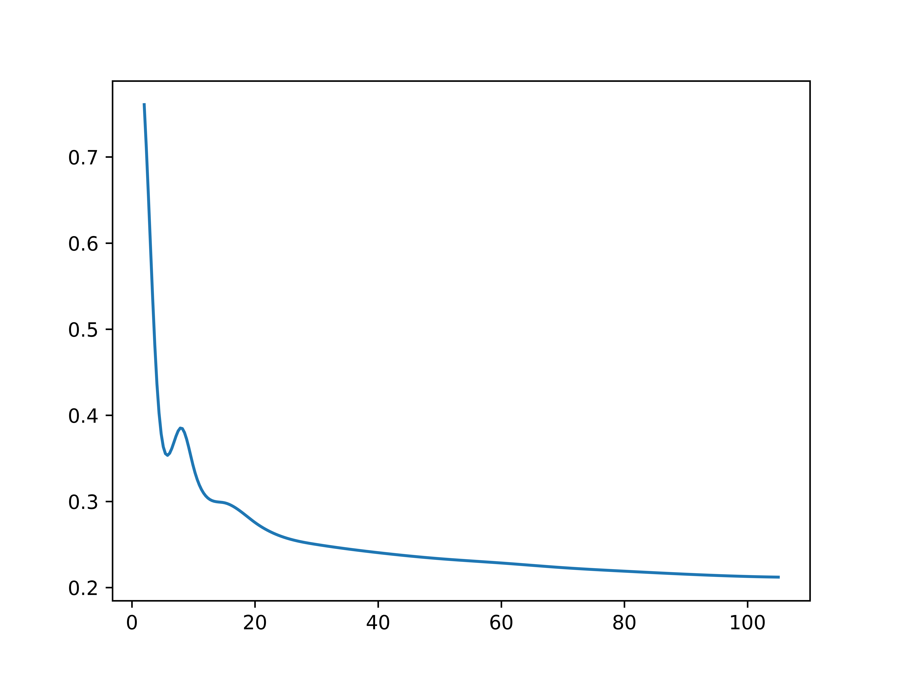

## 面向人脸识别的深度学习模型结果分析

### 1. keras深度学习模型训练数据集中标签（即人数）与测试预测准确率的关系

根据我们的实验结果可以看到，数据集中的标签越少，则测试的预测准确率越高。

就比如数据集中如果只包含两个标签，那么我们测到keras模型的最高准确率约为89.35%（详情见twopeopleresult.pdf)，用自己设计的数据集测试下答到了83.4%.

随着数据集中标签数的增加，模型的预测准确率大体上呈现降低的态势。

根据不同标签数组成的散点具体变化的大体平滑曲线见下图(分析代码为evaluatetool中的evaluate.py：

### 2. testtool 输出设计

testtool.py是我们自己设计的而非调用keras的测试方法。

以测试其他人的图片是否能够被模型识别出不是模型中的人为例（具体输出结果参见Otherpeopletest-result),我们选取了与原本图像集中人物不同的人物的头像作为测试集，调用模型判断是否能确定其不在原标签组里，最终得到的测试准确率为77.78%